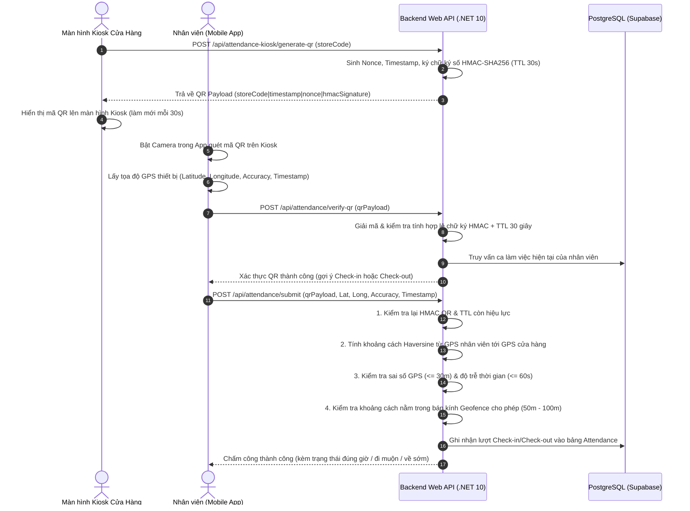

# HỆ THỐNG QUẢN LÝ BÁN LẺ & CHẤM CÔNG RETAIL365 (MANAGE365)
> **Giải pháp toàn diện kết hợp Web Admin, Backend API (.NET 10) và Mobile App (Flutter) với công nghệ Chấm công Đa tầng: Dynamic QR Code HMAC-SHA256 kết hợp GPS Geofencing.**

[](https://dotnet.microsoft.com/)
[](https://flutter.dev/)
[](https://dart.dev/)
[-336791?logo=postgresql&logoColor=white)](https://supabase.com/)
[](file:///C:/Users/boomh/OneDrive/Documents/mobile%20app%20hrm/BAO_CAO_HE_THONG_BACKEND_VA_MOBILE_APP.md)
[](https://www.manage365.io.vn)

---

## 📌 MỤC LỤC
1. [Giới Thiệu Tổng Quan](#1-giới-thiệu-tổng-quan)
2. [Kiến Trúc Hệ Thống](#2-kiến-trúc-hệ-thống)
3. [Các Phân Hệ & Tính Năng Nổi Bật](#3-các-phân-hệ--tính-năng-nổi-bật)
4. [Công Nghệ & Thư Viện Sử Dụng](#4-công-nghệ--thư-viện-sử-dụng)
5. [Danh Sách RESTful API Endpoints](#5-danh-sách-restful-api-endpoints)
6. [Cấu Trúc Thư Mục Dự Án](#6-cấu-trúc-thư-mục-dự-án)
7. [Hướng Dẫn Cài Đặt & Chạy Ứng Dụng](#7-hướng-dẫn-cài-đặt--chạy-ứng-dụng)
   - [7.1 Yêu cầu môi trường tiên quyết](#71-yêu-cầu-môi-trường-tiên-quyết)
   - [7.2 Cài đặt & Khởi chạy Mobile App (Flutter)](#72-cài-đặt--khởi-chạy-mobile-app-flutter)
   - [7.3 Cài đặt & Khởi chạy Backend Web API (.NET 10)](#73-cài-đặt--khởi-chạy-backend-web-api-net-10)
8. [Kết Quả Kiểm Thử (Unit Tests)](#8-kết-quả-kiểm-thử-unit-tests)
9. [Kế Hoạch & Lộ Trình Phát Triển](#9-kế-hoạch--lộ-trình-phát-triển)

---

## 1. GIỚI THIỆU TỔNG QUAN

**Retail365 (Manage365)** là hệ thống quản trị vận hành bán lẻ và chấm công nhân sự theo thời gian thực, giải quyết triệt để các bài toán gian lận chấm công (chấm công hộ qua ảnh chụp, giả lập GPS, v.v.).

Hệ thống bao gồm hai phân hệ chính:
- **Backend Web API & Admin Portal (`manage365`)**: Xây dựng trên nền tảng **.NET 10.0** (ASP.NET Core Web API & Razor MVC), kết nối cơ sở dữ liệu **PostgreSQL (Supabase)**, cung cấp cổng quản trị cho chủ cửa hàng và động cơ API xử lý mã hóa bảo mật.
- **Retail Management Mobile App (`retail-management-app`)**: Ứng dụng di động dành cho nhân viên cửa hàng, phát triển bằng **Flutter (Dart)** hỗ trợ cả Android và iOS, tích hợp quét mã QR bằng camera và định vị GPS thời gian thực.

> 🌐 **Hệ thống Backend đã triển khai (Production):**
> - **Domain chính**: `https://www.manage365.io.vn`
> - **Tài liệu Swagger UI tương tác**: `https://www.manage365.io.vn/swagger/index.html`

---

## 2. KIẾN TRÚC HỆ THỐNG

### 2.1 Sơ đồ kiến trúc tổng thể

```
┌──────────────────────────────────────────────────────────────────────────────────┐
│                             POSTGRESQL (SUPABASE)                                │
│                   - Lưu trữ dữ liệu quan hệ, tài khoản, ca làm                   │
│                   - Lịch sử chấm công, Audit log cấu hình vị trí                 │
└────────────────────────┬────────────────────────────────┬────────────────────────┘
                         │                                │
                         ▼                                ▼
┌──────────────────────────────────────────────────────────────────────────────────┐
│                    BACKEND WEB API & ADMIN PORTAL (.NET 10)                      │
│                                (manage365)                                       │
│                                                                                  │
│  [Web Admin cho Quản lý / Chủ Cửa Hàng]    [RESTful API Engine]                  │
│  - Dashboard & Báo cáo tổng quan          - JWT Authentication & RBAC            │
│  - Cấu hình vị trí GPS & Geofence         - Dynamic QR & HMAC-SHA256 Signing     │
│  - Kiosk sinh mã QR Chấm công động        - GPS Distance Haversine Calculator    │
│  - Quản lý ca làm việc & nhân sự          - Password Reset via SMTP Email        │
│  - Audit log lịch sử thay đổi vị trí      - Rate Limiting chống Brute-force/DoS  │
└────────────────────────────────────────────────┬─────────────────────────────────┘
                                                 │
                                                 │ HTTPS / JSON (Bearer Token)
                                                 ▼
┌──────────────────────────────────────────────────────────────────────────────────┐
│                   RETAIL MANAGEMENT MOBILE APP (FLUTTER)                         │
│                           (retail-management-app)                                │
│                                                                                  │
│  [Dành cho Nhân viên Cửa hàng]                                                   │
│  - Đăng nhập / Đăng xuất / Lưu phiên làm việc tự động (JWT + SharedPreferences)  │
│  - Quên mật khẩu bảo mật qua mã OTP gửi về Email cá nhân                         │
│  - Quét mã QR Kiosk bằng Camera tốc độ cao (mobile_scanner)                      │
│  - Truy xuất tọa độ GPS độ chính xác cao (geolocator) gửi kèm Check-in/out       │
│  - Xem lịch làm việc phân ca trong tuần & lịch sử chấm công cá nhân              │
│  - Cấu hình chuyển đổi máy chủ API trực tiếp ngay trên giao diện                 │
└──────────────────────────────────────────────────────────────────────────────────┘
```

---

### 2.2 Sơ đồ luồng Chấm công Đa tầng (Dynamic QR + GPS Geofencing)



---

## 3. CÁC PHÂN HỆ & TÍNH NĂNG NỔI BẬT

### 🔐 1. Xác thực, Phân quyền & Quản lý Tài khoản (Authentication & RBAC)
- **Đăng ký & Đăng nhập**: Chuẩn hóa email, kiểm tra trùng lặp tài khoản.
- **Bảo mật mật khẩu**: Sử dụng thuật toán băm **PBKDF2** với Salt ngẫu nhiên 128-bit, 100.000 vòng lặp (Rfc2898DeriveBytes).
- **JWT Authentication**: Cấp phát Token chứa User ID, Email, Role (`Admin`, `Manager`, `Staff`), tự động lưu phiên làm việc.
- **Rate Limiting**: Áp dụng giới hạn 5 yêu cầu/phút cho mỗi IP đối với endpoint xác thực để ngăn chặn tấn công từ điển / Brute-force.

### 📧 2. Quên Mật khẩu An toàn qua Email SMTP (Password Reset via SMTP)
- **Yêu cầu cấp lại mật khẩu**: Sinh mã OTP ngẫu nhiên 6 chữ số, băm lưu trong database kèm thời gian hết hạn **15 phút**.
- **Email thông báo**: Gửi email định dạng HTML chuẩn qua máy chủ **SMTP Gmail (SSL/TLS)**.
- **Xác thực OTP**: Kiểm tra mã OTP, giới hạn số lần nhập sai. Sau khi xác thực đúng, trả về **Reset Token được mã hóa an toàn** thông qua cơ chế `IDataProtector` của ASP.NET Core.
- **Đặt lại mật khẩu**: Giải mã Reset Token và cập nhật mật khẩu mới băm PBKDF2 vào hệ thống.

### 📍 3. Chấm công Đa tầng: Dynamic QR Code + GPS Geofencing
- **Chống gian lận chụp ảnh gửi từ xa**: Mã QR Kiosk được ký bằng **HMAC-SHA256** và tự động hết hạn sau **30 giây (TTL 30s)**.
- **Chống Fake GPS (Giả lập vị trí)**:
  - Áp dụng công thức lượng giác **Haversine** để tính khoảng cách thực tế giữa nhân viên và tâm cửa hàng.
  - Kiểm tra độ chính xác GPS: `MaxLocationAccuracyMeters <= 30m`.
  - Kiểm tra độ trễ vị trí: `MaxLocationAgeSeconds <= 60s` (loại bỏ vị trí lưu đệm hoặc tín hiệu cũ).
  - So sánh khoảng cách với bán kính Geofence quy định (mặc định 50m - 100m).
- **Tự động gợi ý hành động**: Hệ thống tự động phát hiện nhân viên đang vào ca (`CHECK_IN`) hay kết thúc ca (`CHECK_OUT`), hỗ trợ cả trường hợp nhân viên chưa được xếp ca trước.

### 🏢 4. Quản trị Vị trí Cửa hàng dành cho Quản lý (Store Geofence Admin)
- Tra cứu cấu hình tọa độ Vĩ độ (`latitude`), Kinh độ (`longitude`) và Bán kính cho phép (`radius_meters`) của từng cửa hàng.
- Cập nhật linh hoạt vị trí khi cửa hàng di dời địa điểm.
- **Audit Log**: Tự động ghi lại nhật ký vào bảng `store_location_audits` (ghi nhận ai sửa, thời điểm sửa, tọa độ cũ và tọa độ mới).

### 📱 5. Ứng dụng Di động Nhân viên (Flutter Mobile App)
- Giao diện người dùng hiện đại, tối ưu trải nghiệm: Đăng nhập, Đăng ký, Quên mật khẩu đa bước trực quan.
- Tích hợp **Mobile Scanner** nhận diện QR siêu tốc.
- Tích hợp **Geolocator** xin cấp quyền vị trí tự động và lấy tọa độ GPS chính xác.
- Màn hình **Dashboard & Lịch làm việc**: Theo dõi ca làm việc trong tuần, thời gian bắt đầu/kết thúc, trạng thái ca.
- Màn hình **Lịch sử chấm công**: Xem lại toàn bộ lịch sử giờ vào, giờ ra, số giờ làm.
- Cấu hình API Server linh hoạt: Cho phép đổi URL Backend động ngay trên App để tiện kiểm thử.

---

## 4. CÔNG NGHỆ & THƯ VIỆN SỬ DỤNG

### 4.1 Phân hệ Backend API & Web Admin (.NET 10)

| Tên Package / Thư viện | Phiên bản | Vai trò & Nghiệp vụ Xử lý |
| :--- | :---: | :--- |
| **`Microsoft.AspNetCore.Authentication.JwtBearer`** | `10.0.12` | Xác thực JWT Token, phân quyền người dùng theo Claims (`sub`, `email`, `role`). |
| **`Npgsql`** | `10.0.3` | Driver ADO.NET hiệu năng cao kết nối PostgreSQL (Supabase). |
| **`Lyntai.Storage.Postgres`** | `3.5.1` | Quản lý kết nối và tối ưu thao tác lưu trữ PostgreSQL. |
| **`Swashbuckle.AspNetCore`** | `10.2.3` | Khởi tạo tài liệu OpenAPI v1 và giao diện kiểm thử Swagger UI. |
| **`System.Security.Cryptography`** (Built-in) | Core | Ký/xác thực mã QR bằng HMAC-SHA256; băm mật khẩu bảo mật PBKDF2 (100.000 rounds). |
| **`Microsoft.AspNetCore.RateLimiting`** (Built-in) | Core | Giới hạn tần suất gọi API chống tấn công DoS và Brute-force. |
| **`System.Net.Mail (SmtpClient)`** (Built-in) | Core | Gửi mã OTP khôi phục mật khẩu qua SMTP Gmail. |
| **`xUnit`, `Moq`, `FluentAssertions`** | `net10.0` | Bộ kiểm thử tự động (Unit Test) cho Geofence, Token Protector và Reset Password. |

---

### 4.2 Phân hệ Mobile App (Flutter)

| Tên Package / Plugin | Phiên bản | Vai trò & Chức năng Xử lý trên Ứng dụng |
| :--- | :---: | :--- |
| **`mobile_scanner`** | `^7.4.2` | Tích hợp Camera quét mã QR chấm công tốc độ cao từ màn hình Kiosk. |
| **`geolocator`** | `^14.1.1` | Truy xuất tọa độ GPS (Vĩ độ, Kinh độ, Accuracy) thời gian thực của nhân viên. |
| **`http`** | `^1.2.2` | Gọi RESTful API gửi nhận JSON, đính kèm Header `Authorization: Bearer <token>`. |
| **`shared_preferences`** | `^2.3.2` | Lưu trữ dữ liệu phiên (Token, thông tin nhân viên) trên bộ nhớ thiết bị. |
| **`qr_flutter`** | `^4.1.0` | Hỗ trợ render mã QR trên thiết bị di động khi cần trao đổi dữ liệu. |
| **`intl`** | `^0.20.3` | Định dạng ngày giờ, ca làm việc và ngôn ngữ hiển thị. |
| **`font_awesome_flutter`** | `^11.0.0` | Bộ biểu tượng giao diện đa dạng chuẩn phong cách ứng dụng hiện đại. |
| **`cupertino_icons`** | `^1.0.8` | Bộ biểu tượng chuẩn iOS. |

---

## 5. DANH SÁCH RESTFUL API ENDPOINTS

Tất cả các endpoint dưới đây được cung cấp tại địa chỉ: `https://www.manage365.io.vn`

| Phương thức | Đường dẫn Endpoint | Phân quyền | Mô tả chi tiết chức năng |
| :---: | :--- | :---: | :--- |
| `POST` | `/api/auth/register` | Public | Đăng ký tài khoản người dùng mới vào hệ thống |
| `POST` | `/api/auth/login` | Public | Đăng nhập hệ thống, trả về Access Token JWT |
| `GET` | `/api/auth/me` | Staff / Admin | Lấy thông tin tài khoản và vai trò của phiên đăng nhập |
| `POST` | `/api/auth/password-reset/request` | Public | Gửi mã OTP xác thực 6 số qua email SMTP Gmail |
| `POST` | `/api/auth/password-reset/verify-code` | Public | Kiểm tra mã OTP và trả về Reset Token được mã hóa |
| `POST` | `/api/auth/password-reset/reset` | Public | Đặt lại mật khẩu mới thông qua Reset Token |
| `POST` | `/api/attendance-kiosk/generate-qr` | Admin / Kiosk | Sinh mã QR chấm công động có chữ ký HMAC (TTL 30s) |
| `POST` | `/api/attendance/verify-qr` | Staff | Quét và kiểm tra tính hợp lệ của chuỗi mã QR Kiosk |
| `POST` | `/api/attendance/submit` | Staff | Chấm công Check-in / Check-out (xác thực QR + GPS Haversine) |
| `GET` | `/api/attendance/my-shifts` | Staff | Lấy danh sách ca làm việc được phân công của nhân viên |
| `GET` | `/api/attendance/history` | Staff | Truy vấn toàn bộ lịch sử chấm công của nhân viên |
| `GET` | `/api/attendance-locations/{storeCode}` | Admin | Tra cứu cấu hình tọa độ GPS và bán kính Geofence cửa hàng |
| `PUT` | `/api/attendance-locations/{storeCode}` | Admin | Cập nhật tọa độ GPS cửa hàng (tự động ghi Audit Log) |

---

## 6. CẤU TRÚC THƯ MỤC DỰ ÁN

Kho mã nguồn hiện tại quản lý phân hệ ứng dụng di động Flutter và liên kết trực tiếp với Backend API:

```
mobile_app_hrm/
├── .github/                                # Cấu hình quy trình CI/CD
├── BAO_CAO_HE_THONG_BACKEND_VA_MOBILE_APP.md# Báo cáo kiến trúc chi tiết hệ thống
├── README.md                               # Tài liệu hướng dẫn dự án & cài đặt
│
└── retail-management-app/
    └── mobile/                             # MÃ NGUỒN ỨNG DỤNG FLUTTER
        ├── android/                        # Cấu hình dự án Android Native
        │   └── app/src/main/
        │       └── AndroidManifest.xml     # Đã cấp quyền Camera, GPS Fine/Coarse Location
        ├── ios/                            # Cấu hình dự án iOS Native
        │   └── Runner/Info.plist           # Khai báo NSCameraUsage & NSLocationUsage
        ├── assets/                         # Hình ảnh, icons và fonts tĩnh
        ├── lib/                            # Mã nguồn logic Flutter (Dart)
        │   ├── core/
        │   │   ├── api_config.dart         # Cấu hình Base URL API (https://www.manage365.io.vn)
        │   │   ├── auth_service.dart       # Xử lý Đăng nhập, Đăng ký, Quên MK, Token JWT
        │   │   ├── attendance_service.dart # Xử lý Verify QR, Submit Chấm công GPS
        │   │   ├── location_service.dart   # Dịch vụ định vị GPS (Geolocator)
        │   │   └── input_validators.dart   # Chuẩn hóa dữ liệu đầu vào (Email, Mật khẩu)
        │   ├── login_screen.dart           # Giao diện Đăng nhập / Đăng ký & Server Dialog
        │   ├── forgot_password_screen.dart # Giao diện Quên mật khẩu đa bước (OTP)
        │   ├── dash_board_screen.dart      # Màn hình chính chấm công & quét mã QR
        │   ├── home_screen.dart            # Giao diện trang chủ nhân viên
        │   ├── schedule_screen.dart        # Màn hình xem lịch làm việc phân ca
        │   ├── theme.dart                  # Cấu hình màu sắc, theme ứng dụng
        │   └── main.dart                   # Entry point khởi chạy ứng dụng Flutter
        ├── test/                           # Bộ kiểm thử tự động cho Mobile
        │   ├── api_config_test.dart        # Kiểm tra tính chuẩn hóa URL API
        │   ├── forgot_password_screen_test.dart# Kiểm tra luồng UI nhập OTP
        │   └── input_validators_test.dart  # Kiểm tra tính hợp lệ email/mật khẩu
        └── pubspec.yaml                    # Quản lý dependencies thư viện Flutter
```

---

## 7. HƯỚNG DẪN CÀI ĐẶT & CHẠY ỨNG DỤNG

### 7.1 Yêu cầu môi trường tiên quyết

Trước khi bắt đầu, đảm bảo máy tính đã cài đặt các công cụ sau:

1. **Flutter SDK**: Phiên bản **>= 3.13** (khuyến nghị Flutter 3.24+ hoặc 3.44+ kèm Dart SDK 3.12+).
   - Kiểm tra bằng lệnh: `flutter --version`
2. **Java Development Kit (JDK)**: Phiên bản **JDK 17** hoặc mới hơn.
3. **Android Studio**: Đã cài đặt Android SDK Command-line Tools, Android SDK Build-Tools và thiết bị ảo (Android Emulator) hoặc máy thật Android có bật *USB Debugging*.
4. **Visual Studio Code** hoặc **Android Studio**: Đã cài đặt tiện ích mở rộng `Flutter` và `Dart`.
5. **.NET 10 SDK** *(Tùy chọn)*: Chỉ cần khi bạn muốn tự chạy Backend Web API trên máy local.

---

### 7.2 Cài đặt & Khởi chạy Mobile App (Flutter)

#### Bước 1: Clone kho mã nguồn về máy
Mở Terminal / PowerShell và thực hiện:
```bash
git clone https://github.com/boomhuyxt/mobile_app_hrm.git
cd "mobile_app_hrm/retail-management-app/mobile"
```

#### Bước 2: Tải các gói thư viện (Dependencies)
```bash
flutter pub get
```

#### Bước 3: Chạy bộ kiểm thử tự động (Unit Tests)
Đảm bảo tất cả các bài kiểm tra đều hoạt động hoàn hảo trước khi khởi chạy ứng dụng:
```bash
flutter test
```
*Kết quả kỳ vọng: `All tests passed!`*

#### Bước 4: Cấu hình địa chỉ Backend API

Ứng dụng đã được tích hợp mặc định trỏ về Server Backend Production:
`https://www.manage365.io.vn`

Bạn có thể tùy biến địa chỉ API theo 3 cách:
- **Cách 1 (Mặc định)**: Không cần cấu hình gì thêm, app tự động kết nối `https://www.manage365.io.vn`.
- **Cách 2 (Thông qua cờ biên dịch lúc chạy)**:
  ```bash
  # Trỏ về Backend Server nội bộ hoặc máy ảo Android (10.0.2.2 cho Android Emulator)
  flutter run --dart-define=API_BASE_URL=https://www.manage365.io.vn
  ```
- **Cách 3 (Thay đổi trực tiếp trên giao diện Mobile)**:
  - Khi mở ứng dụng tại màn hình **Đăng nhập**, nhấp vào biểu tượng **Cài đặt Server** ở góc phải màn hình.
  - Nhập địa chỉ backend mới (ví dụ: `http://192.168.1.100:5000`) và bấm **Lưu & Áp dụng**.

#### Bước 5: Cấp quyền thiết bị khi chạy thực tế
Để các tính năng chấm công hoạt động đầy đủ:
- **Quyền Camera**: Cần thiết khi bấm vào chức năng **Quét mã QR**.
- **Quyền Vị trí (GPS)**: Cần thiết để lấy tọa độ xác thực khoảng cách Geofence đến cửa hàng. Hãy bật GPS trên thiết bị khi chấm công.

#### Bước 6: Khởi chạy ứng dụng

Kiểm tra danh sách thiết bị đang kết nối:
```bash
flutter devices
```

Khởi chạy ứng dụng lên thiết bị mong muốn:
```bash
# Chạy trên thiết bị mặc định (hoặc Emulator đang mở)
flutter run

# Hoặc chạy kiểm thử giao diện trên trình duyệt Chrome
flutter run -d chrome
```

#### Bước 7: Đóng gói bản cài đặt (Build Release)
Khi cần phát hành file cài đặt cho nhân viên:

```bash
# Build file APK Android
flutter build apk --release

# Đường dẫn file APK sau khi build thành công:
# build/app/outputs/flutter-apk/app-release.apk

# Build định dạng Android App Bundle (Google Play Store)
flutter build appbundle --release
```

---

### 7.3 Cài đặt & Khởi chạy Backend Web API (.NET 10)

*(Dành cho lập trình viên muốn tự host hoặc phát triển tiếp phân hệ Backend `manage365`)*

#### Bước 1: Yêu cầu chuẩn bị
- Cài đặt **.NET 10.0 SDK**.
- Cơ sở dữ liệu **PostgreSQL** (khuyến nghị tạo project miễn phí trên [Supabase](https://supabase.com)).
- Tài khoản **Gmail** đã kích hoạt *Mật khẩu ứng dụng (App Password)* phục vụ gửi email OTP.

#### Bước 2: Cấu hình biến môi trường (`appsettings.json` hoặc `.env`)
Tạo hoặc cập nhật file cấu hình của Backend:
```json
{
  "ConnectionStrings": {
    "DefaultConnection": "Host=aws-0-ap-southeast-1.pooler.supabase.com;Port=6543;Database=postgres;Username=postgres.your_project;Password=your_password;"
  },
  "JwtSettings": {
    "Secret": "Chuoi_Bi_Mat_JWT_Sieu_An_Toan_It_Nhat_32_Ky_Tu_123456",
    "Issuer": "manage365.io.vn",
    "Audience": "manage365-client",
    "ExpiryHours": 24
  },
  "SmtpSettings": {
    "Host": "smtp.gmail.com",
    "Port": 587,
    "EnableSsl": true,
    "UserName": "your_email@gmail.com",
    "Password": "your_gmail_app_password"
  },
  "AttendanceSettings": {
    "HmacSecretKey": "Chuoi_Bi_Mat_HMAC_Chong_Gia_Mao_QR_789!@#",
    "QrTtlSeconds": 30,
    "MaxLocationAccuracyMeters": 30.0,
    "MaxLocationAgeSeconds": 60
  }
}
```

#### Bước 3: Phục hồi packages và chạy kiểm thử Backend
```bash
# Điều hướng vào thư mục backend manage365
cd path/to/manage365

# Phục hồi packages NuGet
dotnet restore

# Chạy toàn bộ 17 Unit Tests
dotnet test
```

#### Bước 4: Khởi động Backend Web API & Admin Portal
```bash
dotnet run --project manage365
```
- Truy cập Cổng Quản Trị & Kiosk: `https://localhost:5001`
- Truy cập Swagger API Documentation: `https://localhost:5001/swagger`

---

## 8. KẾT QUẢ KIỂM THỬ (UNIT TESTS)

Dự án áp dụng quy trình kiểm thử tự động nghiêm ngặt trên cả hai phân hệ:

### ✅ Phân hệ Backend (`manage365.Tests` - 17/17 Tests Passed)
- **`AttendanceGeofenceServiceTests`**: Kiểm tra công thức khoảng cách Haversine, ngưỡng sai số GPS, kiểm tra tính toán ngoài bán kính và thời gian thiết bị.
- **`PasswordResetServiceTests`**: Kiểm tra tính năng sinh mã OTP 6 số, giới hạn thời gian hết hạn (15 phút), kiểm tra chống Brute-force khi nhập sai nhiều lần.
- **`PasswordResetTokenProtectorTests`**: Kiểm tra mã hóa và giải mã bảo vệ Token bằng ASP.NET Core Data Protection.
- **`SmtpCredentialTests` & `LocalEnvFileTests`**: Kiểm tra tải an toàn biến môi trường và kết nối máy chủ gửi mail.

```text
Passed!  - Failed: 0, Passed: 17, Skipped: 0, Total: 17, Duration: 345 ms
```

### ✅ Phân hệ Mobile App (`retail-management-app/mobile/test` - 100% Passed)
- **`api_config_test.dart`**: Kiểm tra chuẩn hóa đường dẫn Swagger, xóa trailing slash, fallback default URL.
- **`forgot_password_screen_test.dart`**: Kiểm tra các bước UI khôi phục mật khẩu, kiểm tra trạng thái nhập rỗng và validation.
- **`input_validators_test.dart`**: Kiểm tra tính hợp lệ định dạng email doanh nghiệp và độ mạnh mật khẩu.

```text
00:02 +8: All tests passed!
```

---

## 9. KẾ HOẠCH & LỘ TRÌNH PHÁT TRIỂN

- [x] Hoàn thiện hệ thống xác thực JWT, bảo mật mật khẩu PBKDF2.
- [x] Hoàn thiện luồng quên mật khẩu qua mã OTP gửi qua SMTP Gmail.
- [x] Hoàn thiện động cơ chấm công đa tầng Dynamic QR (HMAC-SHA256 TTL 30s) + GPS Geofencing (Haversine).
- [x] Hoàn thiện giao diện Web Admin Kiosk và Mobile App Flutter.
- [x] Đạt 100% Unit Tests trên cả Backend và Mobile.
- [ ] **Giai đoạn tiếp theo**:
  - Tích hợp dịch vụ **Firebase Cloud Messaging (FCM)** gửi thông báo đẩy (Push Notification) nhắc ca làm trước 15 phút.
  - Xây dựng module xuất báo cáo bảng chấm công và tính lương ra file **Excel / PDF**.
  - Bổ sung quy trình nộp và duyệt **Đơn xin nghỉ phép / Đổi ca trực tuyến** ngay trên ứng dụng di động.

---

## 👥 THÔNG TIN DỰ ÁN & ĐÓNG GÓP

- **Đơn vị phát triển**: Nhóm phát triển Hệ thống Quản trị Bán lẻ Retail365 (Manage365).
- **Mã nguồn**: [GitHub Repository](https://github.com/boomhuyxt/mobile_app_hrm.git)
- **Tài liệu báo cáo chi tiết**: Xem thêm tại [BAO_CAO_HE_THONG_BACKEND_VA_MOBILE_APP.md](file:///C:/Users/boomh/OneDrive/Documents/mobile%20app%20hrm/BAO_CAO_HE_THONG_BACKEND_VA_MOBILE_APP.md).
